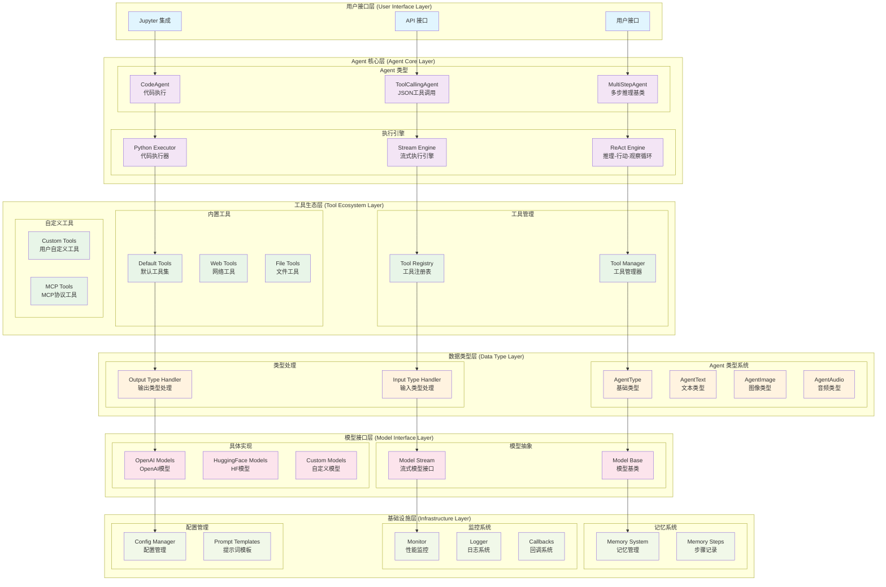
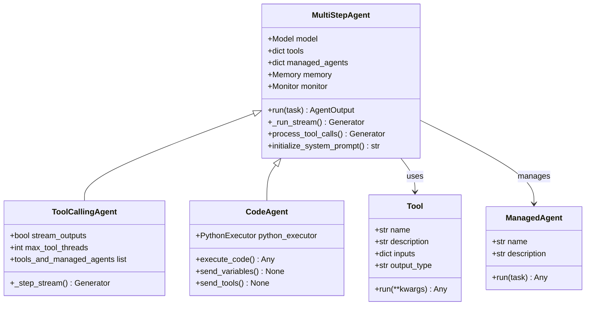
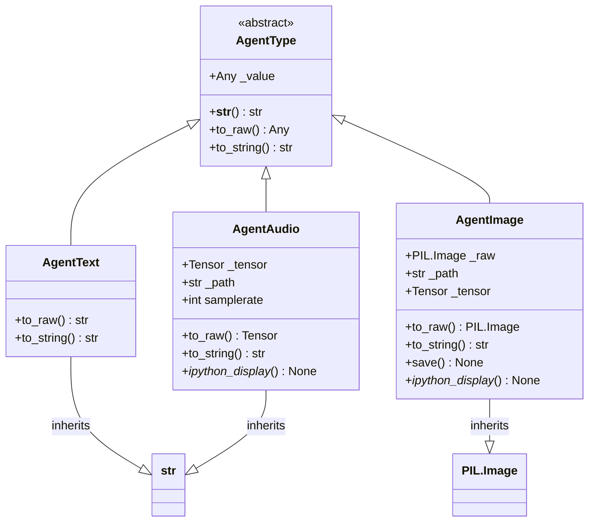
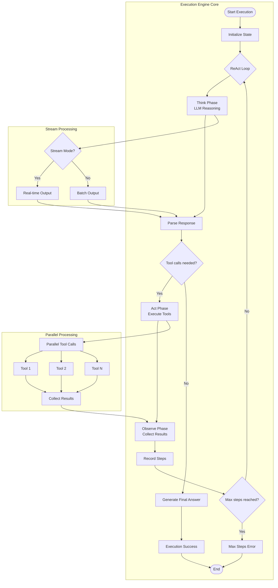
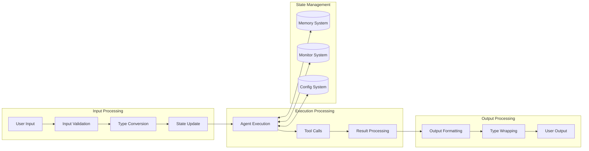
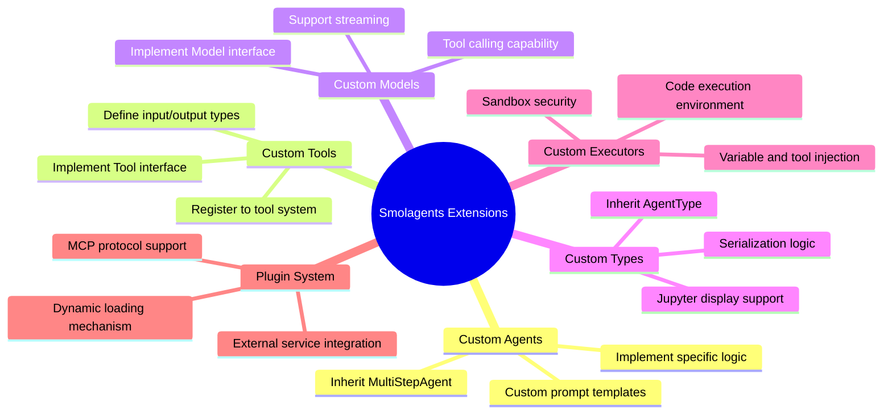

# 🏗️ Smolagents 系统架构设计

## 📋 架构概览

Smolagents 是一个现代化的多模态 AI Agent 框架，采用分层架构设计，支持多种 Agent 类型和执行模式。

## 🎯 核心设计理念

- **模块化设计**：各组件职责清晰，松耦合高内聚
- **多模态支持**：统一处理文本、图像、音频等数据类型
- **可扩展性**：支持自定义工具、Agent 和执行器
- **类型安全**：完整的类型系统和验证机制
- **流式处理**：支持实时交互和进度反馈

---

## 🏛️ 整体系统架构



---

## 🔄 Agent 执行流程架构

```mermaid
sequenceDiagram
    participant User as User
    participant Agent as Agent
    participant Engine as Engine
    participant Tools as Tools
    participant Model as LLM
    participant Memory as Memory

    User->>Agent: run(task, images, args)
    
    Agent->>Agent: Initialize state and params
    Agent->>Memory: Reset/Update memory
    Agent->>Engine: Start execution engine
    
    loop ReAct Loop
        Engine->>Model: Send conversation history
        Model-->>Engine: Return response (stream/batch)
        
        alt Tool calls needed
            Engine->>Tools: Parse and execute tool calls
            Tools-->>Engine: Return tool results
            Engine->>Memory: Record tool call steps
        else Final answer generated
            Engine->>Memory: Record final answer
            break End loop
        end
        
        Engine->>Engine: Check max steps limit
    end
    
    Engine-->>Agent: Return execution result
    Agent-->>User: Return final output
```

---

## 🧩 核心组件详细架构

### 1. Agent 类型架构



### 2. 数据类型系统架构



### 3. 执行引擎架构



---

## 🔧 关键设计模式

### 1. 策略模式 (Strategy Pattern)
- **Agent 类型**：不同的 Agent 实现不同的执行策略
- **工具调用**：JSON 调用 vs 代码执行
- **模型接口**：支持不同的 LLM 提供商

### 2. 观察者模式 (Observer Pattern)
- **回调系统**：监听 Agent 执行步骤
- **监控系统**：收集性能指标
- **日志系统**：记录执行过程

### 3. 工厂模式 (Factory Pattern)
- **Agent 创建**：根据配置创建不同类型的 Agent
- **工具注册**：动态创建和注册工具
- **类型转换**：自动创建合适的 AgentType

### 4. 装饰器模式 (Decorator Pattern)
- **AgentType**：为原始数据类型添加额外功能
- **工具包装**：为函数添加 Agent 工具接口
- **流式处理**：为普通方法添加流式能力

### 5. 模板方法模式 (Template Method Pattern)
- **Agent 执行**：定义执行框架，子类实现具体步骤
- **工具调用**：统一的调用流程，不同的解析策略

---

## 📊 数据流架构



---

## 🚀 扩展点架构



---

## 📈 性能和可扩展性设计

### 1. 并发处理
- **并行工具调用**：ThreadPoolExecutor 支持
- **流式处理**：异步生成器模式
- **资源管理**：自动清理临时文件

### 2. 内存管理
- **延迟加载**：按需加载大型数据
- **缓存机制**：智能缓存计算结果
- **垃圾回收**：自动清理无用对象

### 3. 错误处理
- **分层异常**：不同层次的专用异常类型
- **优雅降级**：部分功能失败不影响整体
- **错误恢复**：自动重试和回退机制

---

## 🎯 架构优势

1. **模块化设计**：各组件独立开发和测试
2. **类型安全**：完整的类型系统和验证
3. **多模态支持**：统一处理各种数据类型
4. **可扩展性**：丰富的扩展点和插件机制
5. **性能优化**：并行处理和流式输出
6. **用户友好**：直观的 API 和 Jupyter 集成

这个架构设计确保了 Smolagents 既能满足当前的需求，又具备良好的扩展性和维护性，是一个现代化的 AI Agent 框架的典型实现。